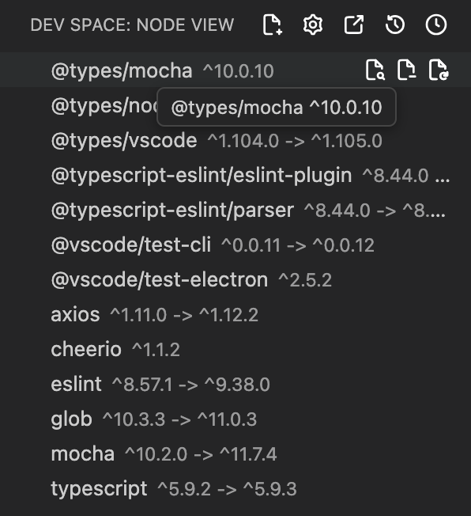
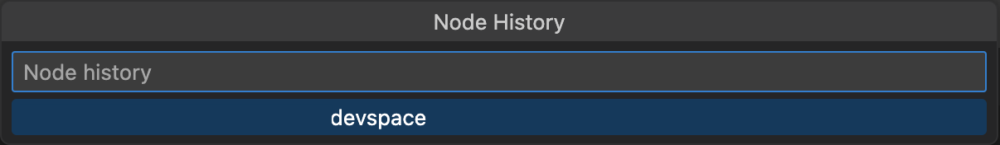
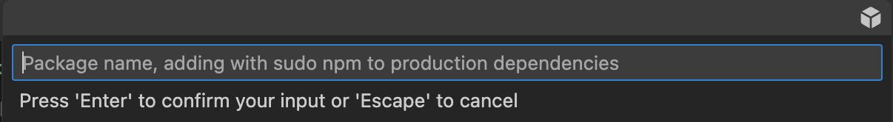
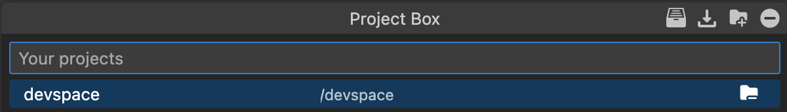
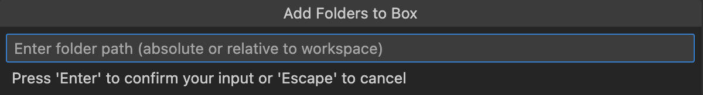
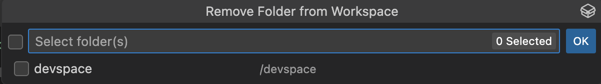
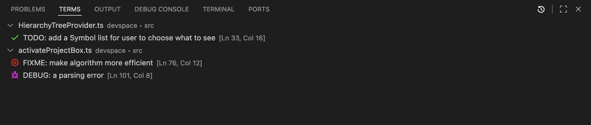
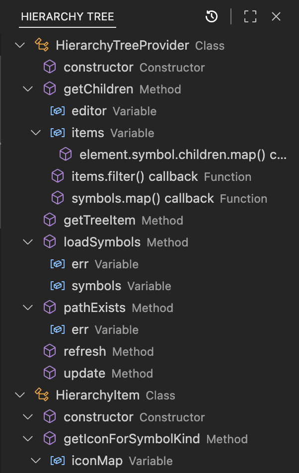

    
    <h1 align="center">Dev Space</h1>

<a href="https://github.com/Creaion" style="text-decoration: none">

    

</a>
<a href="https://github.com/zer0code9/devspace" style="text-decoration: none">

    
    
    
    

</a>
<a href="https://marketplace.visualstudio.com/items?itemName=SlashDEV.devspace" style="text-decoration: none">

    
    
    
    

</a>

> **WARNING**: Dev Space has crashed after the update v2.0.2 and I am trying to fix it. There might be more publications after this one that don't work as I am trying to fix it. If it doesn't work when installed, go install the stable version v2.0.1. I will try to fix this as fast as I can.

This is an extension to make VSCode better.

It includes Node View, Project Box, Term Pad, and Hierarchy Tree.

Keybindings:
- Show Command Prompt [Ctrl+Alt+C] [⌃ ⌥ C]
- Open Dev Space Settings [Ctrl+Alt+S] [⌃ ⌥ S]
- Focus Dev Space [Ctrl+Alt+D] [⌃ ⌥ D]

## Node View

Look at all your node dependencies in the Dev Space view container under Node View view. Switch between projects without breaking a sweat as it is done automatically!

Your workspace should contain workspace folders with node and package.json to be able to use it. Use `Ctrl+Alt+D | ⌃ ⌥ D` to open Node View and go right into it! There are little icons that appear on the right when you hover over the items to perform actions like opening in npmjs.com, installing, updating, and uninstalling. You can use either npm, bun, and yarn by clicking the setting icon or going to the Dev Space settings. If the root is secured, the package manager can use `sudo`. You can check your current node root by hovering the Node View status item. Node History permits you to switch back to a node project with one click but it will not be saved and is deleted when VSCode is closed (can hold up to 10 projects). By allowing Show New Version, Node View shows if a new version of a package is available.

When installing a new package, you can tell the program to either add it to the production dependencies (dependencies) or development dependencies (devDependencies) by clicking the icon in the top right. Packages can be in the following formats: `[<package>]` or `@[<category>]/[<package>]` (check npmjs.com for the name).

Keybindings:
- Show Node History [Ctrl+Alt+H] [⌃ ⌥ H]

Configurations:
- Node Root: The path to the workspace folder [string | null] (not synced)
- Package Manager: The package manager to use ['npm' | 'bun' | 'yarn'] (not synced)
- Secured Root: Whether to use 'sudo' for package manager [boolean] (not synced)
- Show New Version: Whether to show the new version in Node View [boolean] (synced)

## Project Box

See your saved projects from your Project Box and add them to your Workspace. There are multiple commands that you can use; See them in the Project Box quick pick by using `Ctrl+Alt+B | ⌃ ⌥ B`.

You can perform multiple actions like adding and removing folders to or from the Project Box and/or the Workspace. You can add a project to your Workspace with Project Box with one click instead of going through your file explorer. You can import projects into the Project Box from the workspace or with the project Uri. The project doesn't need to be a node project. Your projects are not synced across devices so that you can have different project groups for your different devices. There is a Project Box status item to quickly go to the Project Box and tells you how many projects there is in it.

Keybindings:
- Show Project Box [Ctrl+Alt+B] [⌃ ⌥ B]
- Show Workspace [Ctrl+Alt+W] [⌃ ⌥ W]

Configurations:
- Projects: The saved projects [string[]] (not synced)

## Term Pad

See all the todos, fixmes, debugs, ... left by your cocoders from one click away. Understand them at a glance with the different icons. There is a status item indicating the the number of fixmes and todos.

The term should be in the format of in a comment: `term: ...` (case insensitive). Terms work in JS/TS:JSX/TSX (`//`, `/* */`, `/** */`), Java + Kotlin + C + C++ (`//`, `/* */`), Python (`#`, `""" """`), Ruby (`#`, `=begin =end`), HTML (`<!-- -->`), CSS + SCSS (`/* */`). The file with the terms must be opened to see them (will change). Clicking a term will forward your cursor to where that term is. There is a Term Pad status item that the tells the number of fixmes and todos there are in your opened documents. Therefore, fixmes and todos are required to be in the Terms list.

Keybindings:
- Show Term Pad (Terms) [Ctrl+Alt+T] [⌃ ⌥ T]
- Show Problem Pad (Problems) [Ctrl+Alt+P] [⌃ ⌥ P]

Configurations:
- Terms: The terms to look for [string[] (('todo' & 'fixme') | 'debug' | 'review' | 'hack' | 'note')] (synced)

## Heirarchy Tree (not in v2.0.1)

The full breadcrums list is right on your IDE with all the available information on the currently opened document file. It is available for multiple languages and is structured as a tree. Clicking any symbol will forward the curcor to where that symbol is.

**Hope you enjoy Dev Space!**

> **WARNING**: May contain code.

Powered by Creaion, Published by SlashDEV