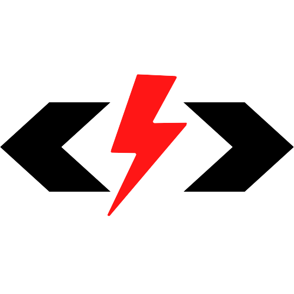

    
  <h1 align="center">Dev Space</h1>

    
    

An extension full of wonderful stuff to kame your programming experience better! It contains snippets, themes, and keymaps. Notebooks will be coming.

## Snippets

In your editor, type the prefix for the snippets

Snippets start with...
- `js` for JavaScript
    - `react` for Reactjs
    - `next` for Next.js
- `py` for Python
- `ht` for HTML
- `cs` for CSS
- `sc` for SCSS

See all the available snippets for a language by typing start prefix.

More Snippets will be coming! (Originally from Snippets Master)

## Themes

There are a few themes you can choose from made with love

- Super Dark Red
- Super Light Red

More Themes will be coming!

## Bug/Bad Syntax

Found a bug or a bad syntax? Email slashdev.mail@gmail.com with the the category, the name if possible, and where the bug/bad syntax is. Thanks for your help!

Want credit? Write your name, username, or gamername in the email. Email addresses will not be sent for credits due to privacy privileges.

## Your Advice

We need your advice to make Dev Space better, tell us what to add! We need to know your favorite snippets, themes, key bindings, etc.

> We will try to add it ASAP

**Hope Dev Space helps you!**

By SlashDEV/Slash (slashdev.mail@gmail.com)