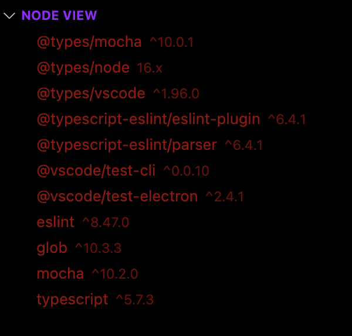

    
    <h1 align="center">Dev Space</h1>

<a href="https://github.com/SlashDEV9" style="text-decoration: none">

    

</a>
<a href="https://github.com/zer0code9/devspace" style="text-decoration: none">

    
    
    
    

</a>
<a href="https://marketplace.visualstudio.com/items?itemName=SlashDEV.devspace" style="text-decoration: none">

    
    
    
    

</a>

This is an extension to make VSCode better.

It includes Node View, snippets, themes, and keybindings. There might be more in the future!

## Node View

Look at all your node dependencies in the SlashDEV view container under Node View view. Switch between workspace folders without breaking a swear as it is done automatically!

Your workspace should contain workspace folders with node and package.json to be able to use it for now. Use `ctrl+shift+z` to open Node View and go right into it! There are little icons that appear on the right when you hover over the items to perform actions like opening in npmjs.org, updating, and uninstalling. You can use either npm and yarn by going to the Dev Space settings.

## Project Box (in the works)

See current projects as well as the ones you have saved. Switch between projects with ease or put multiple together.

## Dev Space Keybindings

<table>
    <tr><th>Keys</th><th>Command</th></tr>
    <tr><td>Ctrl+Alt+r</td><td>Show Node Root</td></tr>
    <tr><td>Ctrl+Alt+n</td><td>Show Node View</td></tr>
    <tr><td>Ctrl+Alt+b</td><td>Show Project Box</td></tr>
</table>

## Snippets

In your editor, type the prefix for the snippets

Snippets start with...
- `js` for JavaScript
    - `react` for Reactjs
    - `next` for Next.js
- `py` for Python
- `ja` for Java
- `ht` for HTML
- `md` for Markdown
- `cs` for CSS
- `sc` for SCSS

See all the available snippets for a language by typing start prefix.

## Themes

There are a few themes you can choose from:

- Super Dark Red
- Classic Dark Red
- Super Dark Punk

## More Keybindings

Use the useful and fast keybindings of Dev Space

<table>
    <tr><th>Keys</th><th>Command</th></tr>
    <tr><td>Alt+.</td><td>Opens command prompt</td></tr>
    <tr><td>Alt+p</td><td>Shows all the problems</td></tr>
    <tr><td>Alt+a</td><td>Goes to the previous error</td></tr>
    <tr><td>Alt+d</td><td>Goes to the next error</td></tr>
    <tr><td>Alt+x</td><td>Deletes current line</td></tr>
</table>

Also install [VSCodine](https://marketplace.visualstudio.com/items?itemName=SlashDEV.vscodine)!

**Hope you enjoy Dev Space!**

Powered by SlashDEV