

    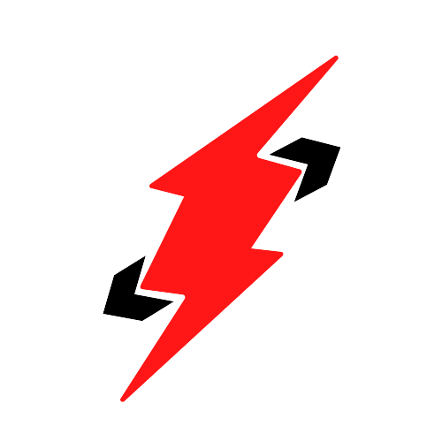
    <h1 align="center">Dev Space</h1>

<a href="https://github.com/Creaion" style="text-decoration: none">

    

</a>
<a href="https://github.com/zer0code9/devspace" style="text-decoration: none">

    
    
    
    

</a>
<a href="https://marketplace.visualstudio.com/items?itemName=SlashDEV.devspace" style="text-decoration: none">

    
    
    
    

</a>

This is an extension to make VSCode better.

It includes Package View, a smart package manager, and Project Box, a box that contains projects by category or not.

As well as Term Pad and Hierarchy Tree.

Keybindings:
- Show Command Prompt `[Ctrl+Alt+C]` `[⌃ ⌥ C]`
- Open Dev Space Settings `[Ctrl+Alt+S]` `[⌃ ⌥ S]`
- Focus Dev Space `[Ctrl+Alt+D]` `[⌃ ⌥ D]`

## Package View

Look at all your packages in the Dev Space view container under Package View view. Switch between projects without breaking a sweat as it is done automatically!

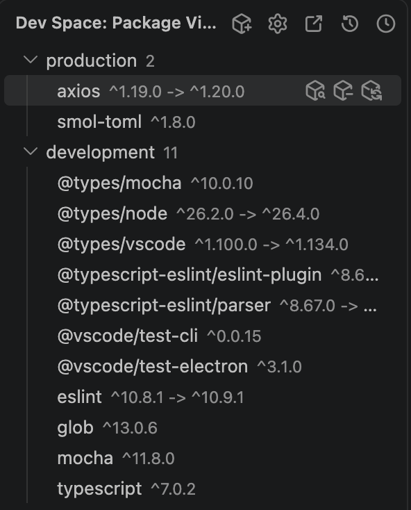

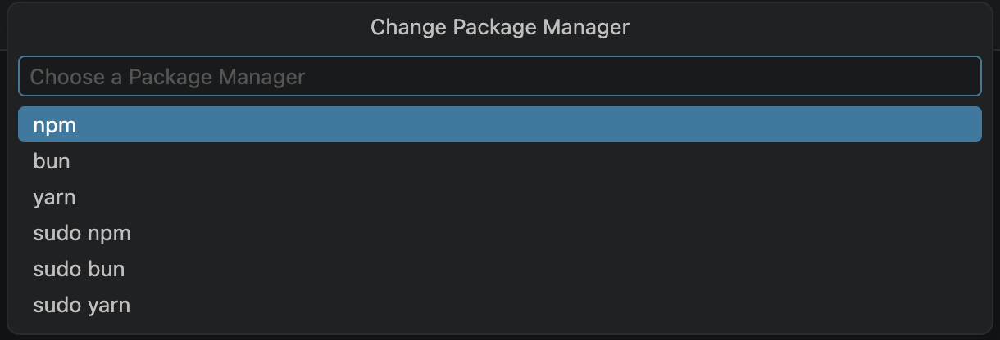

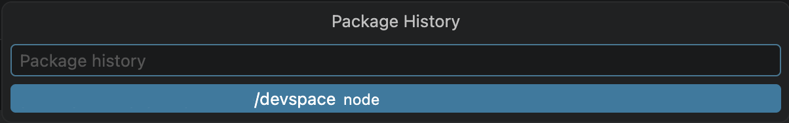

Your workspace should contain workspace folders with a package file for node, pip, or crate to be able to use it. Use `Ctrl+Alt+D | ⌃ ⌥ D` to open Package View and go right into it! At the top, there are icons to allow actions like installing packages, changing the package manager, etc. There are little icons that appear on the right when you hover over the items to perform actions like opening package to the respective website, updating, and uninstalling. For node and pip, the package manager can be changed by clicking the setting icon or going to the Dev Space settings. If the root is secured, the package manager can use `sudo` (Not needed for cargo). You can check your current package root by hovering the Package View status item. Package History permits you to switch back to a packaged project with one click but it will not be saved and is deleted when VSCode is closed (can hold up to 10 projects). By allowing Show New Version, Package View shows if a new version of a package is available. By allowing Show Sections, Package View shows the packages in production and development seperately (on by default).

Node (JS/TS): Requires the `package.json` file. Package managers are `npm`, `bun`, and `yarn`. [npmjs.com](npmjs.com)

Pip (Python): Requires the `pyproject.toml` file. Package managers are `uv` and `poetry`. [pypi.org](pypi.org)

Crate (Rust): Requires the `Cargo.toml` file. Package manager is `cargo`. [crates.io](crates.io)

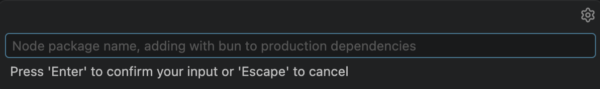

When installing a new package, you can tell the program to either add it to the production dependencies or development dependencies by clicking the icon in the top right. Packages can be in the following formats: `[<package>]` or `@[<category>]/[<package>]` (check the websites for the name).

Keybindings:
- Show Package History `[Ctrl+Alt+H]` `[⌃ ⌥ H]`

Configurations:
- Package Root: The path to the workspace folder `[string | null]` (not synced)
- Secured Root: Whether to use 'sudo' for the package manager `[boolean]` (not synced)
- Package Managers: The package managers to use for node, pip, and crate `[string[] [('npm' | 'bun' | 'yarn'), ('uv' | 'poetry'), 'cargo']]` (not synced)
- Show New Version: Whether to show the new version in Package View `[boolean]` (synced)
- Show Sections: Whether to show sections in Package View `[boolean]` (synced)

## Project Box

See your saved projects from your Project Box and add them to your Workspace. Categorize your projects from your Project Box. See your Project Box quick pick by using `Ctrl+Alt+B | ⌃ ⌥ B`.

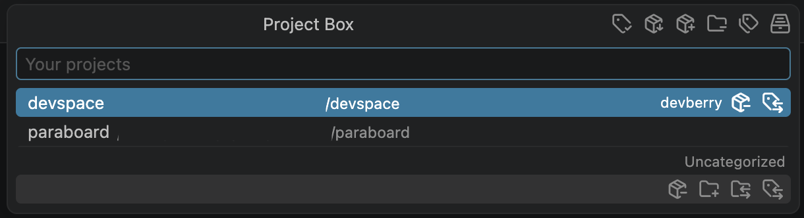

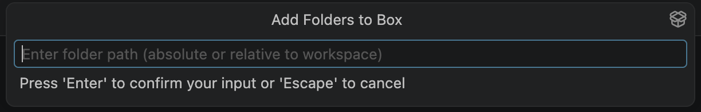

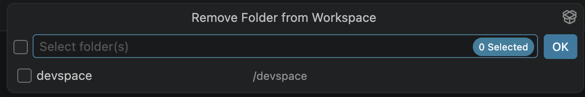

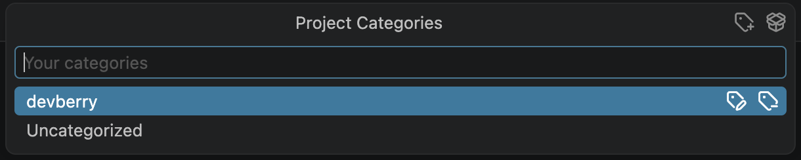

You can perform multiple actions like adding and removing folders to or from the Project Box and/or the Workspace. You can add a project to your Workspace with Project Box with one click instead of going through your file explorer. You can import projects into the Project Box from the workspace or with the project Uri. Your projects are not synced across devices so that you can have different project groups for your different devices. There is a Project Box status item to quickly go to the Project Box and tells you how many projects there is in it.

Projects can be categorized directly from the Box. Categories can be added, removed, or edited. A project's category can be switched. If a project doesn't have a user-made category, it will be put in the Uncategorized category.

Keybindings:
- Show Project Box `[Ctrl+Alt+B]` `[⌃ ⌥ B]`
- Show Workspace `[Ctrl+Alt+W]` `[⌃ ⌥ W]`

Configurations:
- Projects: The saved projects `[interface Project { name: string, path: string, category: string }[]]` (not synced)
- Categorize Projects: Whether to categorize projects in the Project Box `[boolean]` (not synced)
- Project Categories: The categories for projects `[string[] ['Uncategorized', ...]]` (not synced)

## Term Pad

See all the todos, fixmes, debugs, ... left by your cocoders from one click away. Understand them at a glance with the different icons. There is a status item indicating the the number of fixmes and todos.

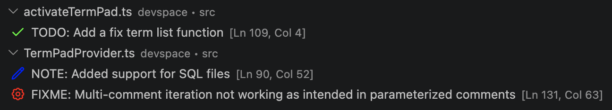

The term should be in the format of in a comment: `term: ...` (case insensitive). Terms work in JS/TS:JSX/TSX (`//`, `/* */`, `/** */`), Java + Kotlin + C + C++ + Rust + Go (`//`, `/* */`), Python (`#`, `""" """`), Ruby (`#`, `=begin =end`), HTML (`<!-- -->`), CSS + SCSS (`/* */`). The file with the terms must be opened to see them. Clicking a term will forward your cursor to where that term is. There is a Term Pad status item that the tells the number of fixmes and todos there are in your opened documents. Therefore, fixmes and todos are required to be in the Terms list.

Keybindings:
- Show Term Pad (Terms) `[Ctrl+Alt+T]` `[⌃ ⌥ T]`
- Show Problem Pad (Problems) `[Ctrl+Alt+P]` `[⌃ ⌥ P]`

Configurations:
- Terms: The terms to look for `[string[] ['todo', 'fixme', 'debug'?, 'review'?, 'hack'?, 'note'?]]` (synced)

## Heirarchy Tree

The full breadcrums list is right on your IDE with all the available information on the currently opened document file.

It is available for any language that allows symbols in VSCode and is structured as a tree. Clicking any symbol will forward the curcor to where that symbol is. Depending on where you click in the editor, the symbol closest is revealed in the tree. By allowing Auto Close Tree, Hierarchy Tree collapse all symbols that aren't used to reveal the current symbol (on by default).

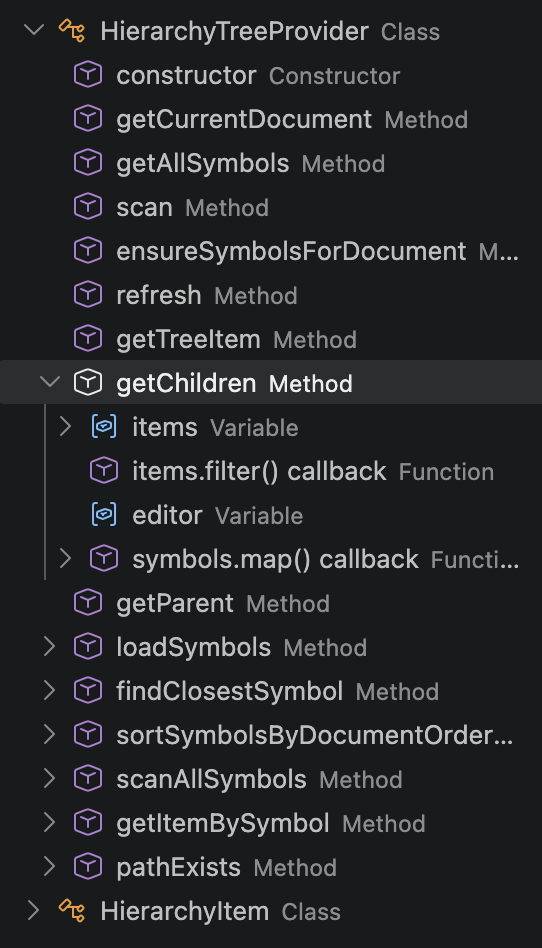

Configurations:
- Auto Collapse Tree: Whether to automatically collapse the hierarchy tree symbols that don't reveal the current symbol `[boolean]` (synced)

**Hope you enjoy Dev Space!**

> **WARNING**: May contain code.

Powered by Devberry (SlashDEV)