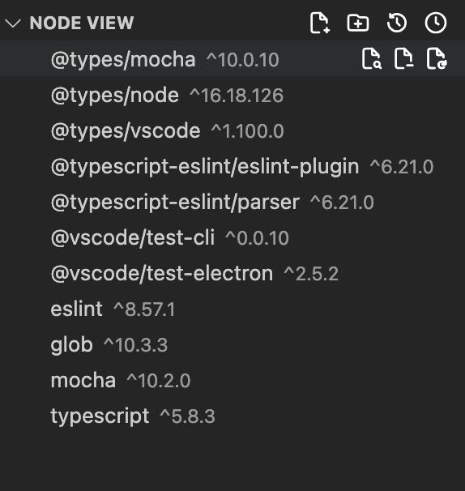
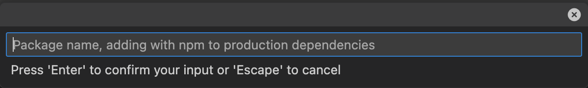
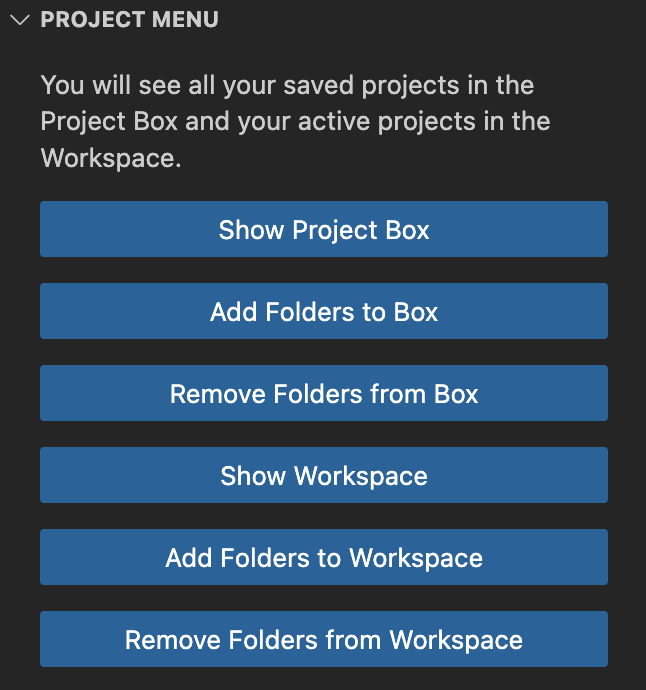
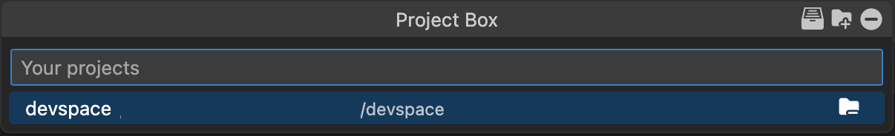
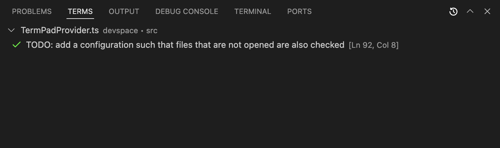

    
    <h1 align="center">Dev Space</h1>

<a href="https://github.com/Creaion" style="text-decoration: none">

    

</a>
<a href="https://github.com/zer0code9/devspace" style="text-decoration: none">

    
    
    
    

</a>
<a href="https://marketplace.visualstudio.com/items?itemName=SlashDEV.devspace" style="text-decoration: none">

    
    
    
    

</a>

This is an extension to make VSCode better.

It includes Node View, Project Box, Term Pad, and snippets.

Keybindings:
- Show Command Prompt [Ctrl+Alt+C] [⌃ ⌥ C]
- Open Dev Space Settings [Ctrl+Alt+S] [⌃ ⌥ S]
- Focus Dev Space [Ctrl+Alt+D] [⌃ ⌥ D]

## Node View

Look at all your node dependencies in the Dev Space view container under Node View view. Switch between workspace folders without breaking a sweat as it is done automatically!

Your workspace should contain workspace folders with node and package.json to be able to use it. Use `Ctrl+Alt+D | ⌃ ⌥ D` to open Node View and go right into it! There are little icons that appear on the right when you hover over the items to perform actions like opening in npmjs.org, updating, and uninstalling. You can use either npm, bun, and yarn by going to the Dev Space settings. If the root is secured, NPM and Yarn can use sudo (this doesn't apply to bun; install it such it is global and doesn't require verification) Node History permits you to switch back to a node project with one click but it will not be saved and is deleted when VSCode is closed (can hold up to 10 projects).

When installing a new package, you can tell the program to either add it to the production dependencies (dependencies) or development dependencies (devDependencies) by clicking the icon in the top right. Packages can be in the following formats: `[<package>]` or `@[<category>]/[<package>]` (check your package manager for the name).

Keybindings:
- Show Node History [Ctrl+Alt+H] [⌃ ⌥ H]

Configurations:
- Node Root: The path to the workspace folder [string | null] (not synced)
- Package Manager: The package manager to use ['npm' | 'bun' | 'yarn'] (not synced)
- Secured Root: Whether to use 'sudo' for package manager [boolean] (not synced)

## Project Box

See your saved projects from your Project Box and add them to your Workspace. There are multiple commands that you can use; See them in the Project Box quick pick.

You can perform multiple actions like adding and removing folders to or from the Project Box and/or the Workspace. You can add a project to your Workspace with Project Box with one click instead of going through your file explorer. The project doesn't need to be a node project. Your projects are not synced across devices so that you can have different project groups for your different devices.

Keybindings:
- Show Project Box [Ctrl+Alt+B] [⌃ ⌥ B]
- Show Workspace [Ctrl+Alt+W] [⌃ ⌥ W]

Configurations:
- Projects: The saved projects [string[]] (not synced)

## Term Pad

See all the todos, fixmes, debugs, ... left by your cocoders from one click away. Understand them at a glance with the different icons.

The term should be in the format of in a comment: `term: ...` (case insensitive). Terms work in JS/TS:JSX/TSX (`//`, `/* */`, `/** */`), Java + Kotlin + C + C++ (`//`, `/* */`), Python (`#`, `""" """`), Ruby (`#`, `=begin =end`), HTML (`<!-- -->`), CSS + SCSS (`/* */`). The file with the terms must be opened to see them (will change). Clicking a term will forward your cursor to where that term is.

Keybindings:
- Show Term Pad (Terms) [Ctrl+Alt+T] [⌃ ⌥ T]
- Show Problem Pad (Problems) [Ctrl+Alt+P] [⌃ ⌥ P]

Configurations:
- Terms: The terms to look for [string[] ('todo' | 'fixme' | 'debug' | 'review' | 'hack' | 'note')] (synced)
- Broad Term Search: If checked, it will show the terms for unopened files as well (not working in v2.0.1) [boolean] (synced)

## Snippets

Use snippets to code faster. See all the available snippets for a language by typing start prefix.

Snippets start with...
- `js` for JavaScript
    - `react` for Reactjs
    - `next` for Next.js
- `py` for Python
- `ja` for Java
- `ht` for HTML
- `cs` for CSS
- `sc` for SCSS

> **NOTE**: May disappear in the next update, will go to VSCodine.

**Hope you enjoy Dev Space!**

> **WARNING**: May contain code.

Powered by Creaion, Published by SlashDEV